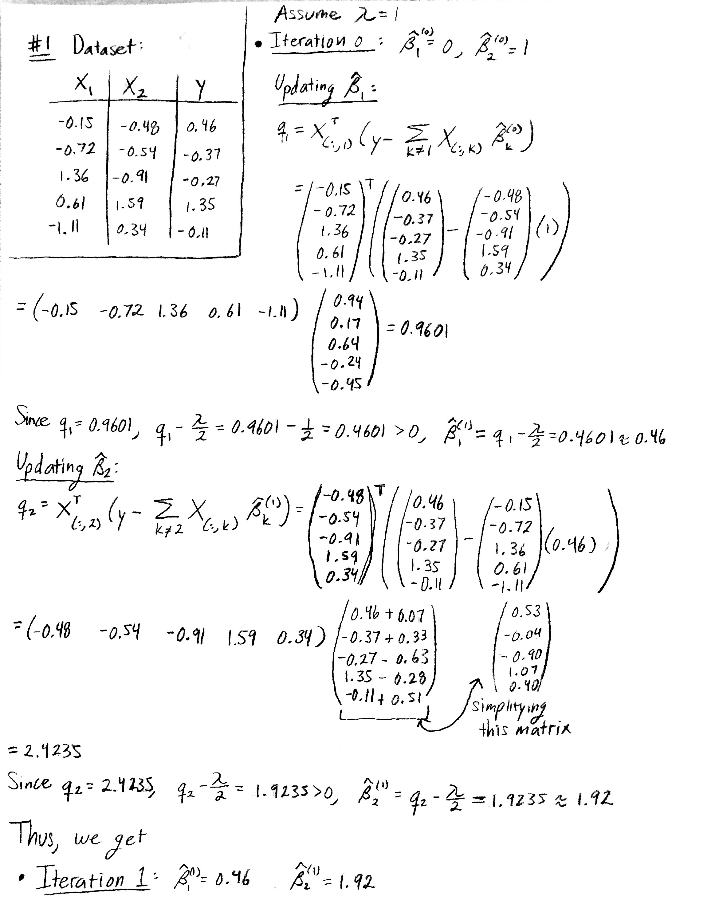
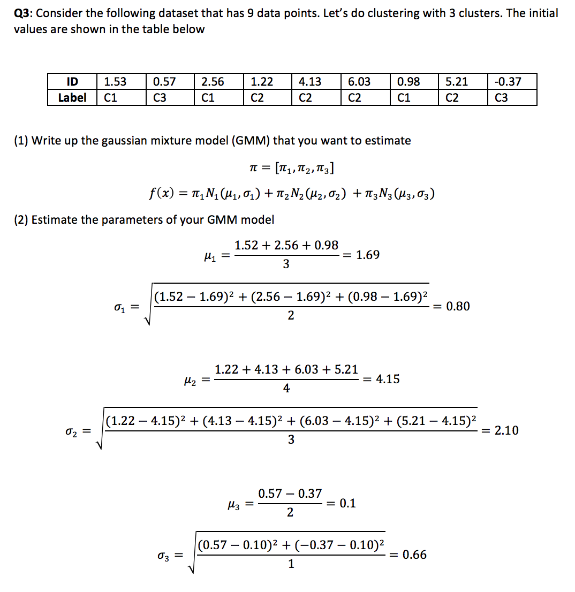
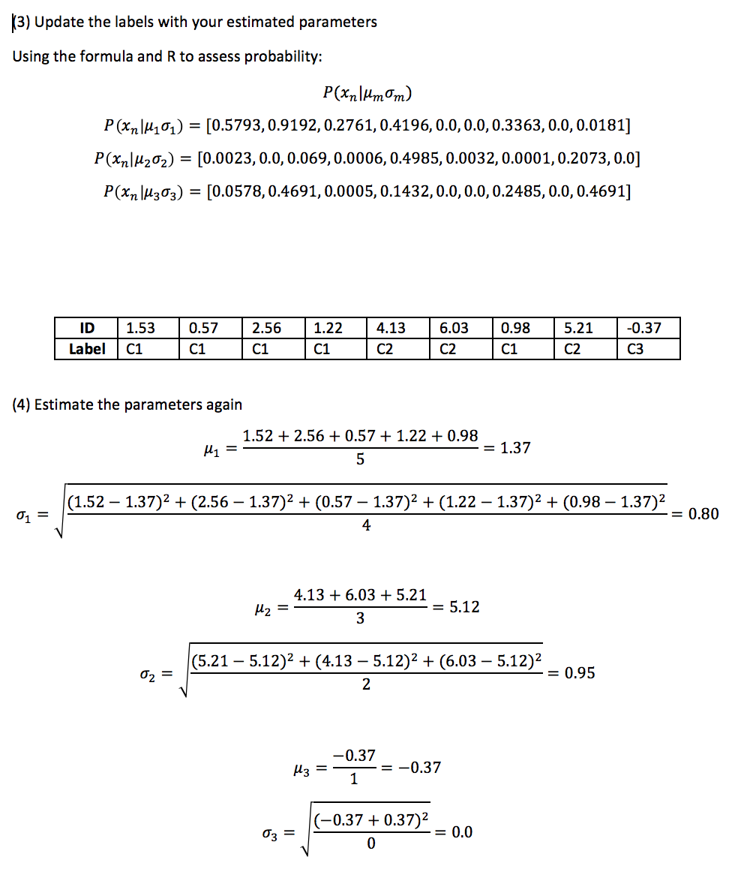
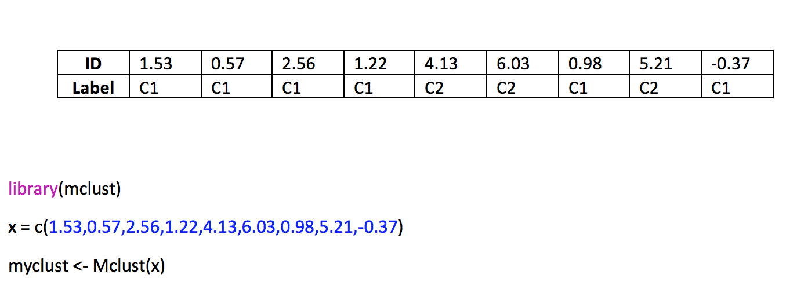

```{r setup, include=FALSE}
knitr::opts_chunk$set(echo = TRUE)
```

# Question 1 
Set an initial value for lambda = 1, beta1 = 0, and beta2 = 1. Implement the Shooting algorithm by your manual operation. Get updated values of beta1 and beta2. Do one iteration.

```{r, out.width = "700px"}

```

# Question 2 
Use the essential R pipeline for LASSO on this data. Compare the result from R and the result by your manual calculation. 

Load and prep the data.
```{r}
# load the data
x_1 <- c(-0.15, -0.72, 1.36, 0.61, -1.11) 
x_2 <- c(-0.48, -0.54, 0.91, 1.59, 0.34) 
Y <- c(0.46, -0.37, -0.27, 1.35, -0.11)
lambda <- 1

# create the matrix X
X <- data.frame(x_1, x_2)

# organize all our data together
data <- data.frame(Y,X)

# create a training data (half the original data size)
set.seed(1)
train.ix <- sample(nrow(data),floor( nrow(data)) * 4 / 5 )
data.train <- data[train.ix,]

# create a testing data (half the original data size)
data.test <- data[-train.ix,]

# some lines of code for glmnet requirements
trainX <- as.matrix(data.train[,-1]) 
testX <- as.matrix(data.test[,-1])
trainY <- as.matrix(data.train[,1])
testY <- as.matrix(data.test[,1])
```
  
When we conduct LASSO for lambda = 1, we notice that both of our 
coefficients are equal to 0. This means that 
lambda = 1 is too big for our coefficients to be nonzero. 
```{r}
# use glmnet package to conduct LASSO; note that we let lambda = 1
require(glmnet)
fit = glmnet(trainX,trainY, family=c("gaussian"), lambda = 1) 
print(fit$beta) # The fitted sparse regression parameters under 
#different lambda values
```

We run LASSO again with defaulted values. We notice that we get 
nonzero coefficients and plot the results. Moreover, we notice that the second coefficient is the first coefficient to become nonzero. We conclude that the second predictor is more important than the first.

Note: This makes sense with our computations from Problem 1 since $\beta_1$ increased from 0 to 0.46 while $\beta_2$ increased from 1 to 1.92.
```{r} 
require(glmnet)
fit = glmnet(trainX,trainY, family=c("gaussian")) 
print(fit$beta) # The fitted sparse regression parameters under different lambda values
plot(fit,label = TRUE)
```

We use cross-validation, keeping in mind that we only have a 
few data points, to decide 
which lambda to use. 
Note: $nfolds = 4$ and $grouped = FALSE$ is enforced. 
```{r}
cv.fit = cv.glmnet(trainX, trainY, nfolds = 4) 
plot(cv.fit) 
```

We see that the cross-validation showed that the best choice for lambda is 0.5010311. This choice will give us a MSE of 0.1620063
```{r}
cv.fit$lambda.min
coef(cv.fit, s = "lambda.min") 
y_hat <- predict(cv.fit, newx = testX, s = "lambda.min") 
cor(y_hat, data.test$Y) 
mse <- mean((y_hat - data.test$Y)^2) 
mse
```

# Question 3 
(1) Write up the gaussian mixture model (GMM) that you want to estimate
(2) Estimate the parameters of your GMM model
(3) Update the labels with your estimated parameters
(4) Estimate the parameters again

```{r, out.width = "700px"}

```

```{r, out.width = "700px"}

```

# Question 4 
Use the essential R pipeline for clustering on this data. Compare the result from R and the result by your manual calculation. 

```{r, out.width = "700px"}

```


# Question 5
Consider the following data. Assume that two trees were built on it. Calculate the variable importance of each variable in RF. 
(1) Calculate the gini index of each node of both trees
(2) Estimate the importance scores of the three variables in these RF model

```{r, out.width = "700px"}

```

```{r, out.width = "700px"}
knitr::include_graphics("Q5_2.png")
```
